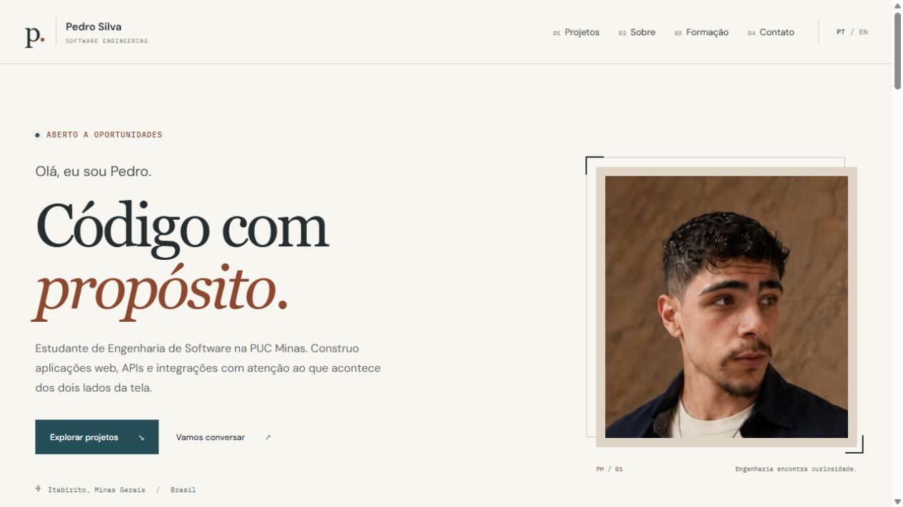
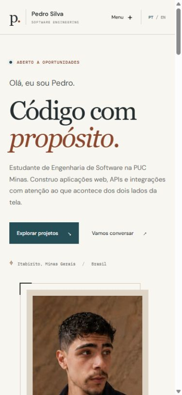

# Pedro Silva — Portfólio

Portfólio de **Pedro Henrique Silva Vargas**, estudante de Engenharia de Software na PUC Minas e técnico em Eletroeletrônica pelo SENAI Itabirito. Reúne projetos pessoais e em equipe, com contexto do problema, participação e estado de cada entrega.

[](https://github.com/PHnsilva/portfolio-PHnsilva/actions/workflows/ci.yml)

- **Site:** [portfolio-phnsilva.vercel.app](https://portfolio-phnsilva.vercel.app)
- **Repositório:** [PHnsilva/portfolio-PHnsilva](https://github.com/PHnsilva/portfolio-PHnsilva)
- **Direção visual e curadoria:** [docs/portfolio-direction.md](docs/portfolio-direction.md)
- **Padrão para revisão dos READMEs:** [docs/README-standard.md](docs/README-standard.md)

## Status

O portfólio usa a branch `master` como origem da publicação na Vercel. A interface tem tema escuro, foto original e elementos de pixel game. O histórico de validação está em [docs/validation.md](docs/validation.md).

## Demonstração

Capturas da reformulação, verificadas no navegador:

| Desktop                                                                    | Celular                                                               |
| -------------------------------------------------------------------------- | --------------------------------------------------------------------- |
|  |  |

## Funcionalidades

- Apresentação imediata, com foto, formação e contatos.
- Galeria com filtros por autoria, capturas reais e seis projetos selecionados: APAC Feminina, CalendarMate, Meritum, PsiHub, Sofiie e SlothSignal.
- Página de detalhes por projeto, com problema, solução, participação, tecnologias e limitações.
- Navegação entre páginas e seções, incluindo Tecnologias, com seleção acompanhando a rolagem, foco no destino, menu para celular e rota de página não encontrada.
- Conteúdo em português e inglês, com preferência salva localmente quando disponível.
- Formulário compacto de contato, encaminhado ao Gmail pelo FormSubmit, e links diretos de e-mail, GitHub e LinkedIn.
- Tema escuro em carvão, cobre e ciano, com retrato original, cenário pixelado e minigame opcional.
- Ferramentas e tecnologias em seis áreas expansíveis, com [origem da seleção](docs/technology-sources.md).
- Pixel racer: carro que acelera sozinho, troca de faixa, obstáculos, distância, pausa e reinício; controles por teclado ou botões no celular.
- Navegação por teclado, foco visível, link para pular conteúdo e respeito à preferência por movimento reduzido.

Os cartões usam **capturas reais** dos projetos. As páginas de detalhes identificam a origem e o contexto de cada imagem. As telas de acesso são vazias, e a captura local da Sofiie está sem conexão com o servidor. Projetos em equipe têm a autoria preservada; as imagens não contêm dados clínicos ou sessões autenticadas. Veja [a origem das capturas](docs/project-images.md).

## Projetos em destaque

| Projeto       | Apresentação                                                                                          | Código                                                  |
| ------------- | ----------------------------------------------------------------------------------------------------- | ------------------------------------------------------- |
| APAC Feminina | [Gestão de medicamentos e estoque](https://portfolio-phnsilva.vercel.app/projetos/apac-feminina)      | Projeto em equipe, repositório restrito                 |
| CalendarMate  | [Agendamentos e integrações](https://portfolio-phnsilva.vercel.app/projetos/calendar-mate)            | [Repositório](https://github.com/PHnsilva/CalendarMate) |
| Meritum       | [Moeda estudantil e reconhecimento acadêmico](https://portfolio-phnsilva.vercel.app/projetos/meritum) | [Repositório](https://github.com/PHnsilva/Meritum)      |
| PsiHub        | [Plataforma web e mobile para psicólogos](https://portfolio-phnsilva.vercel.app/projetos/psihub)      | Projeto em equipe, repositório restrito                 |
| Sofiie        | [Assistente por texto e voz](https://portfolio-phnsilva.vercel.app/projetos/sofiie)                   | [Repositório](https://github.com/PHnsilva/Sofiie)       |
| SlothSignal   | [Notificações Web Push](https://portfolio-phnsilva.vercel.app/projetos/sloth-signal)                  | [Repositório](https://github.com/PHnsilva/SlothSignal)  |

## Tecnologias e arquitetura

**React 19, TypeScript, React Router e Vite 8**, com CSS próprio. Vitest e Testing Library verificam jornadas do visitante. ESLint e Prettier verificam código e formatação. As versões efetivamente instaladas estão no [lockfile](frontend/package-lock.json).

```text
Navegador → React Router → página inicial ou detalhes do projeto
                           ↓
                  dados profissionais PT/EN
```

Aplicação estática, sem backend próprio ou analytics. O formulário faz uma requisição HTTPS à API AJAX do FormSubmit, que encaminha a mensagem ao Gmail de contato. Não há senha de e-mail ou chave secreta no frontend. Inter é usada nos textos, IBM Plex Mono nos detalhes técnicos e Silkscreen nos pequenos elementos de jogo. As fontes são carregadas pelo Google Fonts, com fallback para fontes do sistema. O retrato é servido pelo próprio site.

```text
frontend/
├── public/             Retrato, favicon e robots.txt
├── src/
│   ├── components/     Layout, cartões, elementos pixelados, SEO e jogo
│   ├── data/           Perfil, projetos e origem das imagens
│   ├── i18n/           Idioma e seleção de conteúdo PT/EN
│   ├── games/          Simulação de corrida e colisões do Pixel racer
│   ├── pages/          Início, detalhes e página não encontrada
│   └── index.css       Paleta, tipografia e regras responsivas
├── tests/              Jornadas do visitante
└── vercel.json         Rotas diretas e cabeçalhos
```

## Execução local

Pré-requisitos: Git, **Node.js 24** e npm. A partir de um clone limpo:

```bash
git clone https://github.com/PHnsilva/portfolio-PHnsilva.git
cd portfolio-PHnsilva/frontend
npm ci
npm run dev
```

Abra o endereço exibido pelo Vite, normalmente `http://localhost:5173`. Não há arquivo `.env` obrigatório.

## Verificação

Dentro de `frontend/`:

```bash
npm run lint
npm run format:check
npm test
npm run build
```

Os testes cobrem apresentação imediata, navegação de detalhes para seções, URLs diretas, página inexistente, idioma e persistência, menu móvel, filtros de autoria, abertura e fechamento do jogo e links externos. Eles não substituem a inspeção visual em navegador.

O motor do jogo também tem testes de aceleração, limites da pista, colisão durante mudança de faixa, passagem segura, espaçamento dos obstáculos e consistência entre taxas de quadros. No jogo, use `←` / `→` ou `A` / `D` para dirigir, `P` para pausar e `Esc` para fechar.

O carro começa a 126 km/h e ganha 4,2 km/h por segundo, até 324 km/h. Esses valores são indicadores do minigame, sem pretensão de simulação física.

Os testes do formulário usam respostas simuladas para verificar validação dos campos, prevenção de envios simultâneos, falhas e preservação da mensagem para nova tentativa. Um teste de envio real deve conferir a aceitação pelo serviço e o recebimento no Gmail separadamente.

Para conferir o bundle de produção:

```bash
npm run preview
```

O endereço normalmente será `http://localhost:4173`.

## Formulário de contato

O destinatário é definido em `frontend/src/data/profile.ts`. O formulário envia somente nome, e-mail e mensagem, com assunto e apresentação configurados no componente `ContactForm.tsx`. O e-mail do visitante permite responder ao contato.

O [FormSubmit](https://formsubmit.co/documentation) exige confirmação do destinatário antes de encaminhar mensagens. Na primeira submissão de um domínio, abrir o e-mail de ativação e confirmar o formulário. Um endereço local ou domínio de prévia pode solicitar uma ativação própria. Não confundir essa confirmação com sucesso no envio de uma mensagem.

O formulário mantém o texto em caso de falha, interrompe uma tentativa após 15 segundos e oferece o endereço de e-mail como alternativa. Não repete envios automaticamente. O serviço externo processa os dados e informa retenção das submissões por 30 dias em sua documentação. Conferir sua [política de privacidade](https://formsubmit.co/privacy.pdf) antes de alterar o serviço.

## Publicação

Na Vercel, o projeto deve usar:

| Configuração      | Valor           |
| ----------------- | --------------- |
| Root Directory    | `frontend`      |
| Build Command     | `npm run build` |
| Output Directory  | `dist`          |
| Install Command   | `npm ci`        |
| Node.js           | `24.x`          |
| Production Branch | `master`        |

O arquivo `frontend/vercel.json` oferece fallback para páginas como `/projetos/calendar-mate`, preservando arquivos estáticos. Após integrar o pull request, conferir o deploy e abrir uma rota de projeto diretamente. Uma compilação local não confirma publicação remota.

## Atualizar conteúdo

- Perfil, imagem, contatos e URL canônica: `frontend/src/data/profile.ts`.
- Projetos, participação, status, limites e textos PT/EN: `frontend/src/data/projects.ts`.
- Ferramentas e tecnologias: `frontend/src/data/technologies.ts`.
- Textos da apresentação: `frontend/src/pages/Home.tsx`.
- Cores e tipografia: `frontend/src/index.css`.

Para novos projetos, incluir contexto, contribuição e estado nas duas línguas. Não inserir links de demonstração inexistentes ou dados privados. Conferir a versão publicada do projeto antes de alterar seu status.

## Contribuição e autoria

Esta versão evolui a base acadêmica do portfólio desenvolvido com **Felipe Parreiras** e **Gabriel Nonato**, preservando seus créditos. A personalização e a reformulação deste repositório são voltadas ao portfólio de Pedro Silva.

Alterações devem partir de uma branch própria, passar pelas verificações e ser apresentadas em pull request para `master`. As referências de design e os critérios editoriais estão em [docs/portfolio-direction.md](docs/portfolio-direction.md).

## Licença

[MIT](LICENSE), conforme o arquivo de licença existente no repositório.
